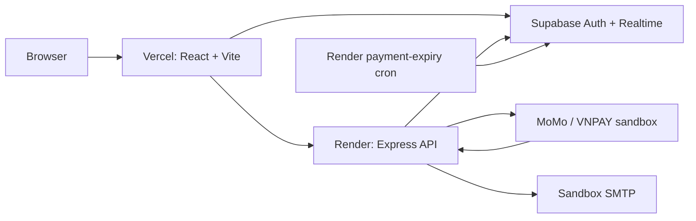

# ReMarket - Second-hand Marketplace


ReMarket is a fullstack second-hand marketplace where users can buy, sell, chat, manage transactions, receive notifications, review other users, and handle payment flows. The project was built as a personal portfolio project for Fullstack / Backend internship applications.

## Live Demo

Deployment configuration is ready; public URLs are pending the one-time Vercel,
Render, and Supabase project connection.

| Resource | Link |
| -------- | ---- |
| Frontend | Pending Vercel project connection |
| API health | Pending Render Blueprint deployment |
| Swagger UI | Pending Render Blueprint deployment |
| 2–3 minute video | Pending capture after URLs are stable |

See the [deployment runbook](Second-handMarketplace/docs/deployment.md) for the
exact publish checklist. Links are intentionally not fabricated before the
platform projects exist.

## Highlights

- Email authentication with Supabase Auth
- Role-based access for customer, agent, and admin users
- Product listing, search, filtering, autocomplete, create, update, and delete
- Seller dashboard and personal product management
- Wishlist and product detail pages
- Buyer-seller transaction flow
- MoMo and VNPAY payment strategy structure
- Supabase Realtime chat, notifications, transaction updates, and unread badges
- User profile, avatar upload, and review system
- Admin dashboard for users, products, transactions, and moderation
- Product/user reports with agent moderation, notifications, and audit history
- Structured request logging, response timing, security headers, liveness, and readiness probes
- Clean frontend route guards for protected pages

## Tech Stack

| Layer                 | Tools                                                                    |
| --------------------- | ------------------------------------------------------------------------ |
| Frontend              | React, Vite, React Router, Zustand, Tailwind CSS, Radix UI, Lucide React |
| Backend               | Node.js, Express, Multer, Nodemailer                                     |
| Database/Auth/Storage | Supabase                                                                 |
| Payment               | MoMo sandbox, VNPAY sandbox strategy modules                             |
| Tooling               | ESLint, Prettier                                                         |

## Architecture



The complete [architecture, ERD, and idempotent payment sequence diagrams](Second-handMarketplace/docs/architecture.md)
show the main table relationships, RLS boundary, callbacks, and realtime update.

## Project Structure

```text
.
+-- Second-handMarketplace/
|   +-- backend/
|   |   +-- scripts/                  # Seed scripts
|   |   +-- src/
|   |   |   +-- controllers/           # HTTP request handlers
|   |   |   +-- middlewares/           # Auth and admin guards
|   |   |   +-- routes/                # Express routes
|   |   |   +-- services/              # Business logic and Supabase access
|   |   |   +-- strategies/            # Payment strategy implementations
|   |   |   +-- workers/               # Standalone background workers
|   |   |   +-- app.js                 # Express app setup
|   |   +-- supabase_migration_fixed.sql
|   |   +-- supabase_seed_marketplace_products.sql
|   +-- frontend/
|   |   +-- src/
|   |   |   +-- components/            # Shared UI components
|   |   |   +-- hooks/                 # Custom React hooks
|   |   |   +-- pages/                 # Auth, client, admin, agent, system pages
|   |   |   +-- services/              # API/Supabase client calls
|   |   |   +-- store/                 # Zustand auth store
|   |   |   +-- utils/                 # Validation and access helpers
|   |   +-- vite.config.js
+-- README.md
```

## Main Features

### Authentication and Roles

- Register with email verification
- Login with Supabase Auth
- Forgot password and reset password flow
- Change password for authenticated users
- Protected routes for logged-in users
- Admin and agent route guards

### Marketplace

- Browse products
- Search and autocomplete
- Filter by category, condition, price, and location
- View product details
- Create, edit, and delete personal product listings
- Seller dashboard
- Wishlist toggle and wishlist status

### Transactions and Payments

- Create transactions from product flows
- Track transaction status
- View transaction history and stats
- Payment creation, return, IPN, query, and refund endpoints
- Strategy-based payment structure for MoMo and VNPAY
- Atomic, idempotent payment callbacks with amount/currency/state verification
- Sanitized callback event storage and transaction status audit logs

### AI Support Chat

- Floating AI support widget available across the frontend
- Retrieval-Augmented Generation (RAG) flow over internal FAQ and policy content
- Answers general marketplace, payment, refund, account, and safety questions
- Does not read personal user data or private order history
- Works in retrieval fallback mode without an API key
- Uses OpenAI Responses API when `OPENAI_API_KEY` is configured on the backend

### Chat, Notifications, Reviews

- Buyer-seller conversations
- Realtime messages scoped by conversation membership and RLS
- Realtime notifications, transaction status, and recoverable unread badges
- Optimistic message reconciliation with client-message idempotency
- Mark conversations as read with persisted `last_read_at`
- User reviews by transaction

### Admin and Agent

- Overview dashboard
- Manage users
- Manage products
- View transactions
- Agent inbox/support flow

## Getting Started

### Prerequisites

- Node.js 18+
- npm
- A Supabase project
- A sandbox transactional SMTP account for verification/reset emails
- MoMo/VNPAY sandbox credentials if you want to test payment gateways

### 1. Clone the repository

```bash
git clone <your-repository-url>
cd <repository-folder>/Second-handMarketplace
```

### 2. Configure Supabase

Run the SQL migrations in your Supabase SQL editor:

```text
Second-handMarketplace/backend/supabase_migration_fixed.sql
Second-handMarketplace/backend/supabase_add_product_image_url.sql
Second-handMarketplace/backend/supabase_payment_lifecycle.sql
Second-handMarketplace/backend/supabase_transaction_invariants.sql
Second-handMarketplace/backend/supabase_payment_idempotency.sql
Second-handMarketplace/backend/supabase_realtime_chat.sql
Second-handMarketplace/backend/supabase_fts_migration.sql
Second-handMarketplace/backend/supabase_database_hardening.sql
Second-handMarketplace/backend/supabase_moderation_reports.sql
```

Apply the payment migrations in the order shown. Payment creation requires an
authenticated buyer, and callback state changes are committed through the
`process_payment_callback` database function so repeated IPN/return requests do
not repeat the transaction transition.

The realtime migration removes browser-side conversation membership mutations,
adds membership-scoped RLS, and publishes chat, notification, participant, and
transaction tables through `supabase_realtime`.

Apply database hardening last. It rejects invalid historical rows before adding
marketplace constraints, enables RLS on every application table, and makes
business-table mutations backend-only.

The moderation migration adds backend-only report and audit tables plus an
atomic resolution RPC for warn, hide-listing, suspend-user, dismiss, and
notification actions.

Optional seed data:

```text
Second-handMarketplace/backend/supabase_seed_marketplace_products.sql
```

### 3. Configure backend environment

Create `Second-handMarketplace/backend/.env` from `Second-handMarketplace/backend/.env.example`.

Required values:

```env
PORT=4000
FRONTEND_ORIGIN=http://localhost:5173

SUPABASE_URL=https://your-project.supabase.co
SUPABASE_SERVICE_ROLE_KEY=your-supabase-service-role-key

SMTP_HOST=sandbox.smtp.example
SMTP_PORT=587
SMTP_USER=your-sandbox-user
SMTP_PASSWORD=your-sandbox-password
MAIL_FROM_EMAIL=no-reply@your-demo-domain.example

PAYMENT_RETURN_URL=http://localhost:5173/payment/return
PAYMENT_NOTIFY_URL=http://localhost:4000/api/payment/ipn/momo

# Optional AI support chat
AI_PROVIDER=
OPENAI_API_KEY=
OPENAI_MODEL=gpt-5.4-nano
GROQ_API_KEY=
GROQ_MODEL=llama-3.3-70b-versatile
GEMINI_API_KEY=
GEMINI_MODEL=gemini-3.1-flash-lite
```

### 4. Configure frontend environment

Create `Second-handMarketplace/frontend/.env` from `Second-handMarketplace/frontend/.env.example`.

```env
VITE_SUPABASE_URL=https://your-project-ref.supabase.co
VITE_SUPABASE_ANON_KEY=your-supabase-anon-key
VITE_BACKEND_URL=http://localhost:4000
```

### 5. Install dependencies

Backend:

```bash
cd backend
npm install
```

Frontend:

```bash
cd ../frontend
npm install
```

### 6. Run the app locally

Start backend:

```bash
cd backend
npm run dev
```

Start frontend in another terminal:

```bash
cd frontend
npm run dev
```

Start the payment-expiry worker in a separate terminal/process:

```bash
cd backend
npm run worker:payment-expiry
```

Open:

```text
http://localhost:5173
```

Backend health check:

```text
http://localhost:4000/api/health
http://localhost:4000/api/ready
```

`/api/health` is a liveness probe only. `/api/ready` verifies required config,
Supabase Postgres and Storage connectivity, and reports which payment gateways
are configured. Logs contain request metadata and duration, never request
bodies, access tokens, passwords, service-role keys, or payment signatures.

Interactive API documentation:

```text
http://localhost:4000/api/docs
http://localhost:4000/api/docs/openapi.json
```

## Seed Test Accounts

After configuring `SUPABASE_URL`, `SUPABASE_SERVICE_ROLE_KEY`, and strong demo
passwords in the environment, seed demo users:

```bash
cd backend
DEMO_ADMIN_PASSWORD=<secret-with-at-least-12-characters>
DEMO_AGENT_PASSWORD=<secret-with-at-least-12-characters>
DEMO_CUSTOMER_PASSWORD=<secret-with-at-least-12-characters>
npm run seed:users
```

The emails are non-secret identifiers; passwords are never stored in the repository:

| Role           | Default email   | Credential source |
| -------------- | --------------- | ----------------- |
| Admin          | admin@test.com  | Deployment secret |
| Agent          | agent@test.com  | Deployment secret |
| Seller         | seller@test.com | Deployment secret |
| Buyer          | buyer@test.com  | Deployment secret |
| Buyer + Seller | both@test.com   | Deployment secret |

For the public portfolio demo, share credentials through the portfolio/video
description and rotate them separately from source. Set
`DEMO_READ_ONLY_ADMIN=true` so visitors can inspect admin pages without changing
users, products, or issuing refunds.

## API Overview

Protected endpoints require:

```http
Authorization: Bearer <supabase_access_token>
```

The interactive Swagger UI at `/api/docs` documents request/response schemas,
example payloads, standardized errors, Bearer authentication, and endpoint role
requirements. The first documented groups are Auth, Products, Transactions,
Payment, and Admin.

### Auth

| Method | Endpoint                        | Description                    |
| ------ | ------------------------------- | ------------------------------ |
| POST   | `/api/auth/register`            | Request signup verification    |
| POST   | `/api/auth/forgot-password`     | Request password reset         |
| POST   | `/api/auth/resend-verification` | Resend verification email      |
| POST   | `/api/auth/change-password`     | Change current user's password |

### Products

| Method | Endpoint                         | Description             |
| ------ | -------------------------------- | ----------------------- |
| GET    | `/api/products`                  | List/search products    |
| GET    | `/api/products/autocomplete`     | Product autocomplete    |
| GET    | `/api/products/:id`              | Product detail          |
| GET    | `/api/products/seller/:sellerId` | Products by seller      |
| GET    | `/api/products/user/my`          | Current user's products |
| POST   | `/api/products`                  | Create product          |
| PATCH  | `/api/products/:id`              | Update product          |
| DELETE | `/api/products/:id`              | Delete product          |

### Profile, Transactions, Chat

| Method | Endpoint                       | Description               |
| ------ | ------------------------------ | ------------------------- |
| GET    | `/api/profile`                 | Get current profile       |
| PUT    | `/api/profile`                 | Update profile            |
| POST   | `/api/profile/avatar`          | Upload avatar             |
| GET    | `/api/transactions`            | List transactions         |
| POST   | `/api/transactions`            | Create transaction        |
| PATCH  | `/api/transactions/:id/status` | Update transaction status |
| GET    | `/api/chat/conversations`      | List conversations        |
| POST   | `/api/chat/messages`           | Send message              |
| POST   | `/api/reports`                 | Report a product or user  |
| GET    | `/api/reports/mine`            | Current user's reports    |

### Admin, Notifications, Wishlist, Reviews, Payments

| Area          | Base Endpoint        |
| ------------- | -------------------- |
| Admin         | `/api/admin`         |
| Notifications | `/api/notifications` |
| Wishlist      | `/api/wishlist`      |
| Reviews       | `/api/reviews`       |
| Upload        | `/api/upload`        |
| Payment       | `/api/payment`       |
| Categories    | `/api/categories`    |
| AI Support    | `/api/ai-support`    |
| Moderation    | `/api/admin/reports` |

## Available Scripts

Backend:

```bash
npm run dev
npm start
npm run worker:payment-expiry
npm run worker:payment-expiry:once
npm test
npm run seed:users
npm run lint
npm run format
```

Frontend:

```bash
npm run dev
npm run build
npm run preview
npm test
npm run lint
npm run format
```

## Portfolio Notes

This project is suitable for showing:

- Backend API design with Express route/controller/service layers
- Supabase Auth integration and role-based authorization
- Real product, transaction, chat, notification, review, and payment flows
- React protected routing and client-side state management
- Practical fullstack environment setup

Deployment assets included in the repository:

- Render Blueprint for the API and scheduled payment expiry
- Vercel Vite/SPA configuration
- Separate Supabase demo project and release checklist
- Architecture, ERD, and payment sequence diagrams
- Screenshot and 2–3 minute video capture plan

## Security Notes

- Do not commit real `.env` files.
- Keep `SUPABASE_SERVICE_ROLE_KEY` only on the backend.
- Use a sandbox transactional SMTP provider, not a personal Gmail account.
- Keep demo passwords in deployment secrets and rotate them regularly.
- Keep public demo admin mutations disabled with `DEMO_READ_ONLY_ADMIN=true`.
- Configure Supabase Auth rate limits and CAPTCHA; login calls Supabase directly.
- Use sandbox credentials for payment testing.

## Author

Built by nduc951-duc as a personal fullstack marketplace project.
