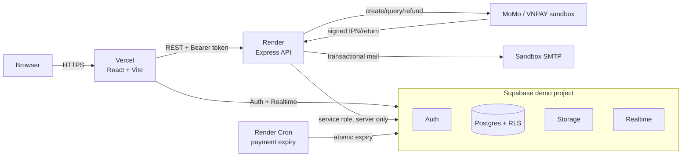
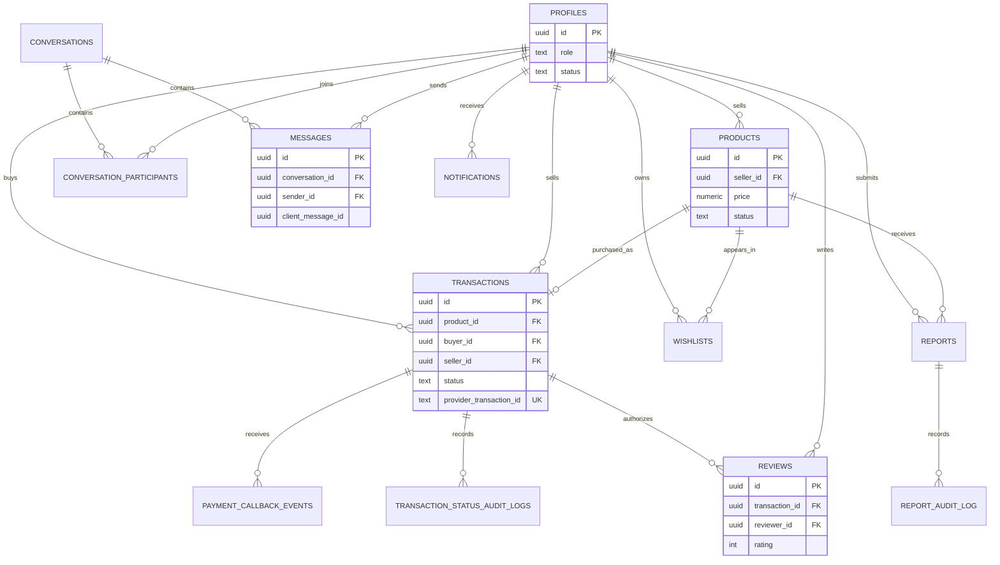
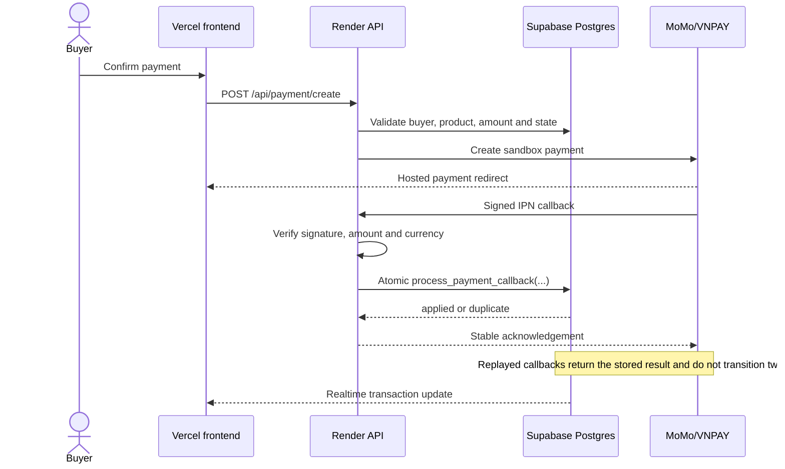

# ReMarket architecture

## Deployment architecture

```mermaid
flowchart LR
  Visitor[Browser] -->|HTTPS| Web[Vercel\nReact + Vite]
  Web -->|REST + Bearer token| API[Render\nExpress API]
  Web -->|Auth + Realtime| SB[Supabase]
  API -->|service role, server only| SB
  Cron[Render Cron\npayment expiry] -->|atomic expiry| SB
  API -->|create/query/refund| Pay[MoMo / VNPAY sandbox]
  Pay -->|signed IPN/return| API
  API -->|transactional mail| SMTP[Sandbox SMTP]

  subgraph SB[Supabase demo project]
    Auth[Auth]
    DB[(Postgres + RLS)]
    Storage[Storage]
    RT[Realtime]
  end
```

## Core ERD

```mermaid
erDiagram
  PROFILES ||--o{ PRODUCTS : sells
  PROFILES ||--o{ TRANSACTIONS : buys
  PROFILES ||--o{ TRANSACTIONS : sells
  PRODUCTS ||--o| TRANSACTIONS : purchased_as
  TRANSACTIONS ||--o{ PAYMENT_CALLBACK_EVENTS : receives
  TRANSACTIONS ||--o{ TRANSACTION_STATUS_AUDIT_LOGS : records
  TRANSACTIONS ||--o{ REVIEWS : authorizes
  PROFILES ||--o{ REVIEWS : writes
  PROFILES ||--o{ WISHLISTS : owns
  PRODUCTS ||--o{ WISHLISTS : appears_in
  CONVERSATIONS ||--o{ CONVERSATION_PARTICIPANTS : contains
  PROFILES ||--o{ CONVERSATION_PARTICIPANTS : joins
  CONVERSATIONS ||--o{ MESSAGES : contains
  PROFILES ||--o{ MESSAGES : sends
  PROFILES ||--o{ NOTIFICATIONS : receives
  PROFILES ||--o{ REPORTS : submits
  PRODUCTS ||--o{ REPORTS : receives
  REPORTS ||--o{ REPORT_AUDIT_LOG : records

  PROFILES {
    uuid id PK
    text role
    text status
  }
  PRODUCTS {
    uuid id PK
    uuid seller_id FK
    numeric price
    text status
  }
  TRANSACTIONS {
    uuid id PK
    uuid product_id FK
    uuid buyer_id FK
    uuid seller_id FK
    text status
    text provider_transaction_id UK
  }
  REVIEWS {
    uuid id PK
    uuid transaction_id FK
    uuid reviewer_id FK
    int rating
  }
  MESSAGES {
    uuid id PK
    uuid conversation_id FK
    uuid sender_id FK
    uuid client_message_id
  }
```

## Idempotent payment callback

```mermaid
sequenceDiagram
  actor Buyer
  participant Web as Vercel frontend
  participant API as Render API
  participant DB as Supabase Postgres
  participant Gateway as MoMo/VNPAY

  Buyer->>Web: Confirm payment
  Web->>API: POST /api/payment/create
  API->>DB: Validate buyer, product, amount and state
  API->>Gateway: Create sandbox payment
  Gateway-->>Web: Hosted payment redirect
  Gateway->>API: Signed IPN callback
  API->>API: Verify signature, amount and currency
  API->>DB: Atomic process_payment_callback(...)
  DB-->>API: applied or duplicate
  API-->>Gateway: Stable acknowledgement
  Note over Gateway,DB: Replayed callbacks return the stored result and do not transition twice
  DB-->>Web: Realtime transaction update
```
